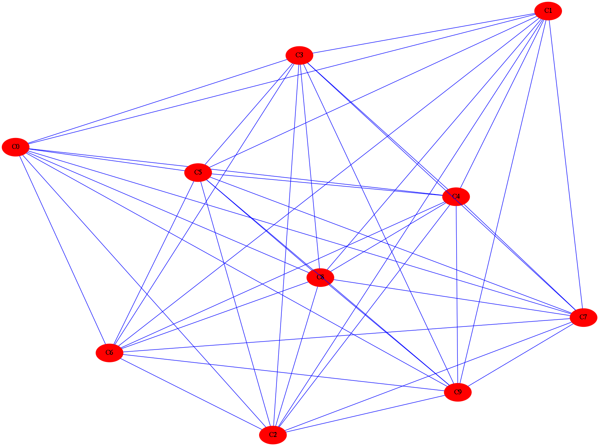

# Mnist-Machine-Learning-Basics
Various methods for image classification of handwritten numbers on the well known image dataset MNIST.

Visualization techniques of the data points as cloud using graph theory and networks.

Run the Main.py first, and then if you want to see some plots run Plots.py

Dependencies for Main.py: numpy , matplotlib , sklearn, collections, itertools.

Dependencies for Plots.py: networkx , matplotlib, scipy, graphviz, pygraphviz

For Plots.py: Load and run Main.py first (better in Spyder or another python-IDE) and then run Plots.py 

Report is available for further information on the Machine Learning algorithms.
=====

# Deep Learning
### Convolutional auto-encoders for denoising
### Recurrent LSTM for language modeling
Various DL methods on image modeling, language translation, and more...

For more information please read the Report_DL.pdf file.

Support GNU/Linux